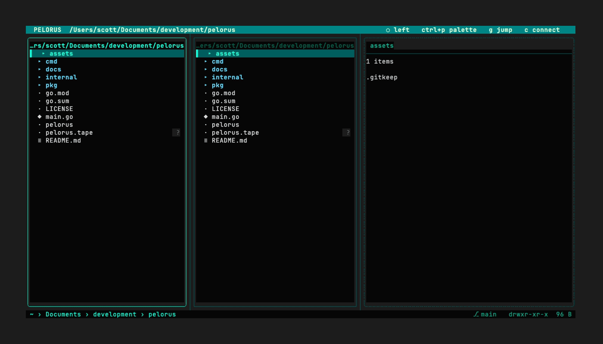

# pelorus


[](https://charm.sh)
[](https://github.com/mogglemoss/pelorus/actions/workflows/ci.yml)

*A file manager with opinions.*

Dual-pane TUI file manager. Local filesystem, SFTP remotes, and Tailscale nodes, addressed identically. Archives behave as directories. Fuzzy filtering everywhere it fits. One static binary, no runtime dependencies, no configuration required to be useful on first launch.

---

## Demo



---

## Features

**Dual pane**
- Left and right panes, always visible — not a mode, not a toggle, just there
- `tab` to switch; `C` / `F5` to copy across; `M` / `F6` to move across
- `<` / `>` to resize the split on the fly
- Background job queue (`J`) with animated progress bars and speed/ETA — operations never block the UI
- Multi-select with `space` — mark items across directories, then copy/move/delete the whole set at once

**Navigation**
- `j` / `k` / `h` / `l` — you know what these do
- Type in any pane to fuzzy-filter its contents live
- `g` opens the jump list — frecency-ranked, fuzzy-searchable, persistent
- `B` to pin the current directory; `~` to go home; `ctrl+l` to type a path directly (tab completes filenames)
- `s` cycles sort order per pane: name → size → date → extension
- `m<key>` sets a named mark on the current directory; `'<key>` jumps back to it instantly (session-scoped)
- `ctrl+f` opens a recursive file search overlay — backed by `fd` (or `find` as fallback), live fuzzy filtering as you type

**Preview pane**
- `p` toggles a third panel: syntax-highlighted code via Chroma, rendered Markdown via Glamour, file metadata for everything else
- Images render as a metadata card — format, dimensions, size, modified time, plus a procedurally-generated tile colored from the image's own pixels. Works over SFTP. Works on any terminal. No external binaries.
- Scrollable with `]` / `[`; inline search with `/` (`n`/`N` to cycle matches)
- Loads asynchronously — the pane spinner tells you it's working

**File operations**
- `o` opens a file with the OS default application (`open` on macOS, `xdg-open` on Linux) — uses the system default, not Finder
- `!` opens a command prompt in the footer; type a shell command and press Enter to run it against the selected file
- `S` drops into an interactive shell in the current directory; the UI resumes on exit
- `Q` opens macOS Quick Look on the selected file
- `R` opens `$EDITOR` with all selected filenames listed — edit the names, save, quit; renames are applied automatically
- `F4` opens the selected file in your configured editor

**Git awareness**
- File-level status glyphs inline in the file list: `M` modified · `A` staged · `D` deleted · `?` untracked
- Branch indicator (`⎇ main`) in the status bar when inside a git repo
- Non-blocking — fetched async with a 5 s cache; invisible outside git repos and on remote panes
- Previewing a modified or staged file shows its `git diff` instead of the file body — additions green, deletions red, hunk headers blue

**Status bar**
- Breadcrumb path with `›` separators, home-dir compressed to `~`
- Centered git branch; remote pane badge (`⇄ user@hostname`) on the right; permissions + size far right
- Archive context shown inline: `~ › projects [archive.zip › src]`
- Transient messages (copy confirmations, errors) override the bar full-width

**Command palette**
- `ctrl+p` or `:` — fuzzy-searches every action, built-in and custom
- Actions grouped by category: Navigation · File · View · App · Custom
- Shows keybindings inline

**Archives as directories**
- Press `l` on a `.zip`, `.tar.gz`, `.tar.bz2`, `.tar.xz`, or `.tar` — it opens as a directory
- Navigate in, copy files out; `h` at the root returns to the real filesystem

**Remote connections**
- `c` opens the connect palette — parses `~/.ssh/config` automatically
- Tailscale nodes appear in a second section, fetched live from the local socket
- Connecting replaces the inactive pane with an SFTP session; all file operations work the same
- Remote panes display `user@hostname:/path` in steel blue — visually distinct from local panes at all times
- `ctrl+d` disconnects cleanly and reverts the pane to the local filesystem

**Custom actions**
- Any shell command is a first-class action
- `{path}`, `{name}`, `{dir}` template variables
- Appears in the command palette, inherits context filtering, bindable to any key

**Theming**
- Built-in *retrofuture subaquatic* theme — bioluminescent teal, ocean dark, phosphor cyan
- Five additional themes: `gruvbox`, `nord`, `light`, `dracula`, `catppuccin`
- `--theme` / `-t` flag to set at launch; or set in config

---

## Installation

### go install

```bash
go install github.com/mogglemoss/pelorus@latest
```

### From source

```bash
git clone https://github.com/mogglemoss/pelorus
cd pelorus
go build -o pelorus .
./pelorus
```

No CGO. No runtime dependencies. One binary.

---

## Usage

```
pelorus [path] [flags]

  path              Directory to open (default: current directory)

  -f, --config      Config file path (default: XDG config dir)
  -t, --theme       Theme name: pelorus · gruvbox · nord · light · dracula · catppuccin
      --demo        Start with a sandboxed demo filesystem (for recordings/screenshots)
      --version     Print version and exit
```

On first run, pelorus writes a fully-commented config file to the XDG config directory (`~/.config/pelorus/config.toml` on Linux, `~/Library/Application Support/pelorus/config.toml` on macOS). Every option is present and explained. Reading it is optional.

Set `start_dir = "last"` in config to always reopen where you left off.

---

## Key Bindings

### Navigation

| Key | Action |
|-----|--------|
| `j` / `↓` | Move down |
| `k` / `↑` | Move up |
| `h` / `←` | Go to parent |
| `l` / `→` / `enter` | Enter directory / open file / open archive |
| `tab` | Switch active pane |
| `g` | Jump list |
| `~` | Go to home directory |
| `ctrl+l` | Go to path (type any path) |
| `s` | Cycle sort: name → size → date → ext |
| `ctrl+f` | Recursive file search |
| `m<key>` | Set mark on current directory |
| `'<key>` | Jump to mark |

### File Operations

| Key | Action |
|-----|--------|
| `space` | Toggle selection (multi-select) |
| `C` / `F5` | Copy selected (or all marked) to other pane |
| `M` / `F6` | Move selected (or all marked) to other pane |
| `F8` / `delete` | Move to trash (OS trash on macOS/Linux) |
| `d` / `⇧F8` | Permanent delete |
| `r` | Rename |
| `R` | Bulk rename in editor |
| `n` / `⇧F7` | New file |
| `N` / `F7` | New directory |
| `F4` | Open in editor |
| `o` | Open with default application |
| `Q` | Quick Look (macOS) |
| `!` | Run shell command on selected file |
| `y` | Copy full path to clipboard |
| `Y` | Copy filename to clipboard |
| `ctrl+r` | Reveal in Finder (macOS) |

### View

| Key | Action |
|-----|--------|
| `p` | Toggle preview pane |
| `]` / `[` | Scroll preview down / up |
| `/` | Search within preview (opens preview pane if needed) |
| `.` | Toggle hidden files |
| `J` | Job queue |
| `<` / `>` | Shrink / grow left pane |

### App

| Key | Action |
|-----|--------|
| `ctrl+p` / `:` | Command palette |
| `c` | Connect to SSH / Tailscale host |
| `ctrl+d` | Disconnect remote pane, revert to local |
| `S` | Drop into shell in current directory |
| `B` | Bookmark current directory |
| `?` | Keybinding reference |
| `q` | Quit |

All keybindings are overridable in config.

---

## Custom Actions

```toml
[[actions.custom]]
id = "custom.open-zed"
name = "Open in Zed"
description = "Open selected file in Zed editor"
category = "Custom"
command = "zed {path}"
context = "always"
```

Template variables: `{path}` full path, `{name}` filename, `{dir}` containing directory. Commands run via `sh -c`. Custom actions appear in the palette and can be bound to any key.

---

## Technical Specifications

| Parameter | Value |
|-----------|-------|
| UI framework | [Bubbletea](https://github.com/charmbracelet/bubbletea) |
| Styling | [Lipgloss](https://github.com/charmbracelet/lipgloss) |
| Syntax highlighting | [Chroma](https://github.com/alecthomas/chroma) |
| Markdown rendering | [Glamour](https://github.com/charmbracelet/glamour) |
| Image preview | Metadata card · `image/*` stdlib decoders + `golang.org/x/image` · sampled-pixel accent color |
| Fuzzy matching | [sahilm/fuzzy](https://github.com/sahilm/fuzzy) — in-process, no fzf binary |
| SFTP | [pkg/sftp](https://github.com/pkg/sftp) + [x/crypto/ssh](https://golang.org/x/crypto) |
| Tailscale | [tailscale.com/client/tailscale](https://pkg.go.dev/tailscale.com/client/tailscale) local socket |
| Config | TOML via [BurntSushi/toml](https://github.com/BurntSushi/toml) |
| Archive formats | `.zip` · `.tar` · `.tar.gz` · `.tar.bz2` · `.tar.xz` — pure Go |
| Jump list | Frecency scoring · XDG data dir · JSON |
| Clipboard | [atotto/clipboard](https://github.com/atotto/clipboard) — CGO-free |
| File search | `fd` preferred, `find` fallback — no Go dependency |
| CGO | Disabled. One static binary. |
| Platforms | macOS · Linux (Tier 1) · Windows (Tier 2) |

---

## Acknowledgments

Pelorus steals thoughtfully from:

| Source | What we took |
|--------|-------------|
| [Marta](https://marta.sh) | Action palette as spine, dual pane as default, archive-as-directory, job queue |
| [ranger](https://github.com/ranger/ranger) | Shell integration (`S`), run-command (`!`), marks (`m`/`'`) |
| [lf](https://github.com/gokcehan/lf) | Async IO pattern, nav/eval/ui separation |
| [yazi](https://github.com/sxyazi/yazi) | Fuzzy-everywhere as interaction model, preview depth |
| [zoxide](https://github.com/ajeetdsouza/zoxide) | Auto-ranked jump list |

---

## License

MIT. See [LICENSE](./LICENSE).
